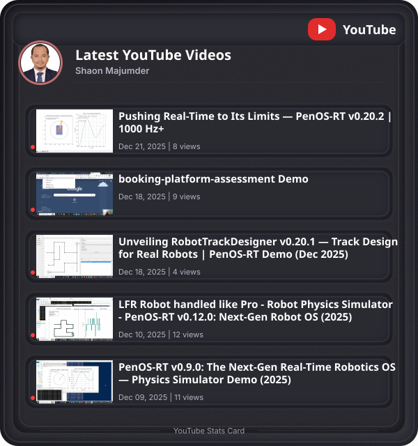
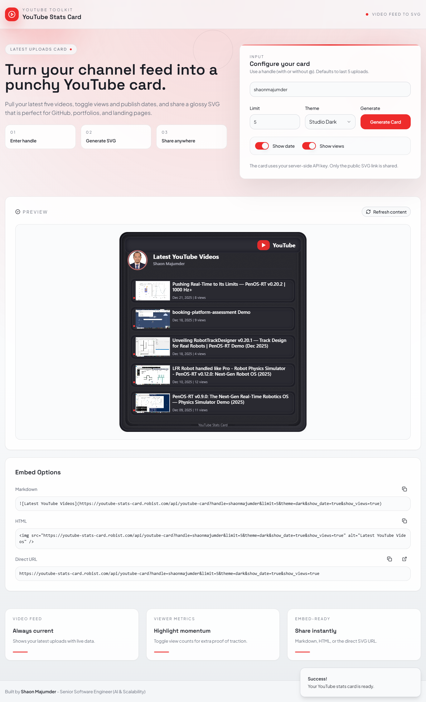

# YouTube Stats Card

Generate a sharp, always-up-to-date SVG card that showcases the latest YouTube uploads for any handle. The project pairs a bold React/Tailwind UI with a lightweight Express API (deployable as a Netlify Function) that calls the YouTube Data API and renders the SVG server-side.

**Live demo:** [https://youtube-stats-card.robist.com/](https://youtube-stats-card.robist.com/)


---

## Features

- **Latest uploads** – Pulls the most recent videos, including thumbnails.
- **Customizable output** – Control limit, theme, publish date, and view count.
- **Serverless-ready** – One Express app runs locally or inside Netlify Functions.
- **Embed options** – Markdown, HTML, and direct URL snippets in the UI.
- **Fast & cacheable** – SVG responses are CDN-friendly and lightweight.

## Demo

## 

## Reliability & Alerting (Built-in)

This project includes a **production-grade alerting model** designed specifically for serverless and edge-style deployments.

**What makes it special:**

- **Noise-free alerts** – avoids email spam during outages or traffic spikes
- **Smart error flood detection** – sends a single alert only when error volume crosses a threshold (e.g. more than 50 errors within 1 hour)
- **Boot-time failure awareness** – detects and alerts on startup misconfiguration immediately
- **API key protection** – notifies once per incident if the YouTube API key is invalid or expired
- **Recovery signals** – sends a recovery notification only after meaningful downtime
- **Quota-safe by design** – preserves email and third-party API limits automatically

All alerting behavior is **self-throttled, deduplicated, and failure-aware**, making the service safe to run continuously without manual supervision.

---

## Usage

### SVG Card

```md

```

### Markdown embedding

```

```

### Optional Query Params

- `limit` – number of videos
- `theme` – `light` or `dark`
- `show_date` – show/hide publish date
- `show_views` – show/hide view count

---

## Deployment

The API is designed to run:

- Locally via Express
- As a Netlify Function
- In any Node.js serverless environment

No code changes required.

---

## Author & Credits

**Built and maintained by [Shaon Majumder](https://shaonresume.robist.com)**
Senior Software Engineer – AI & Scalability

**Connect**

- Portfolio: [https://shaonresume.robist.com](https://shaonresume.robist.com)
- GitHub: [https://github.com/ShaonMajumder](https://github.com/ShaonMajumder)
- LinkedIn: [https://www.linkedin.com/in/shaonmajumder](https://www.linkedin.com/in/shaonmajumder)
- Medium: [https://medium.com/@shaonmajumder](https://medium.com/@shaonmajumder)
- Resume: [https://shaonresume.robist.com/resume.html](https://shaonresume.robist.com/resume.html)

---

Happy building. Drop an issue or PR if you add something awesome.
